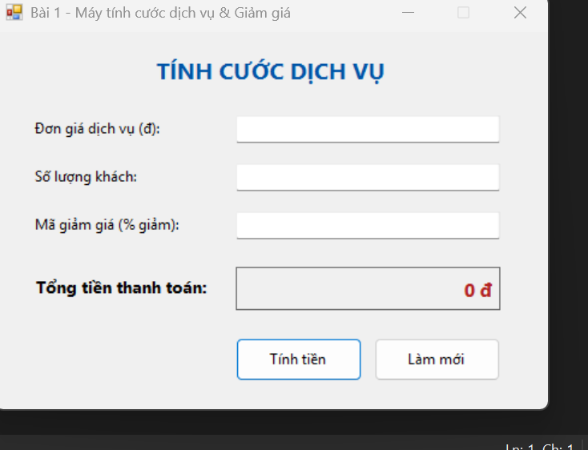
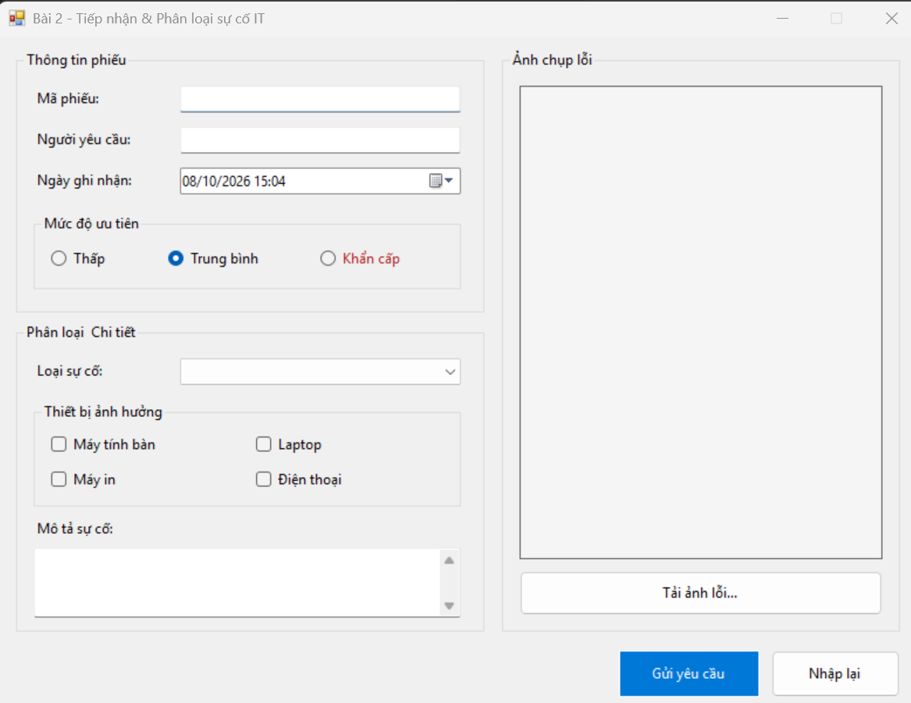
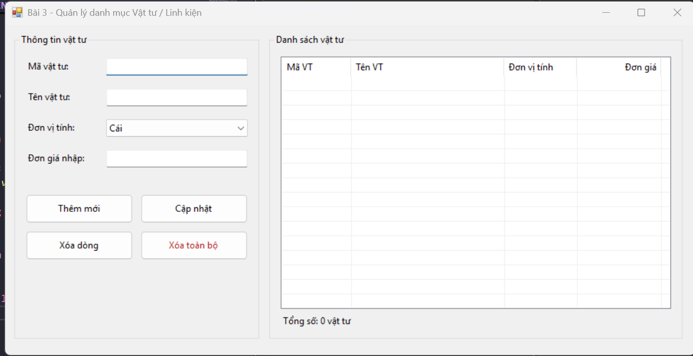
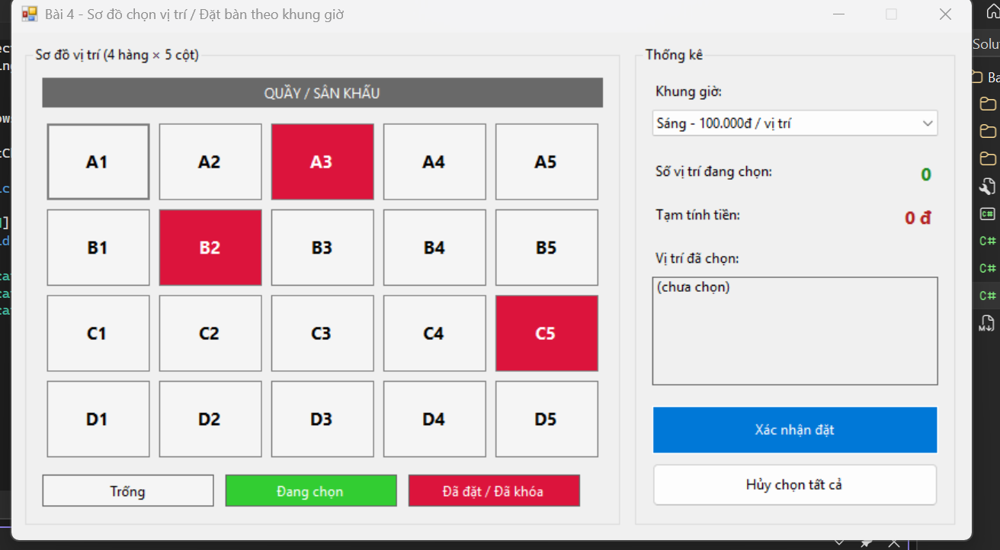
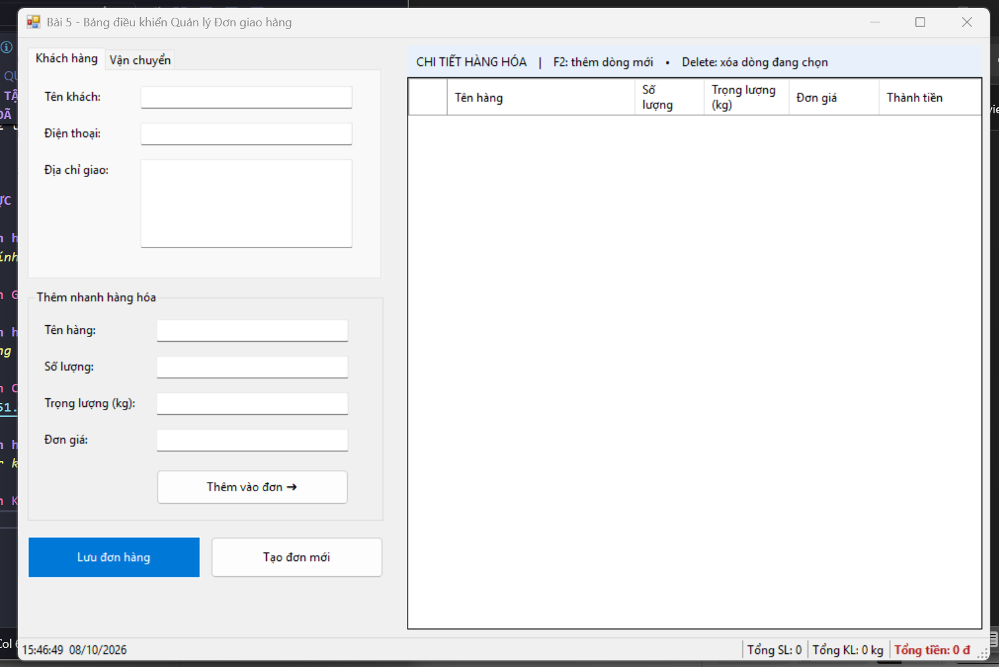

# BÁO CÁO BÀI TẬP / ĐỒ ÁN – ÔN TẬP WINDOWS FORMS

## THÔNG TIN SINH VIÊN
- **Họ và tên:** Trần Thị Kim Liên
- **Mã số sinh viên:** 24810320108
- **Lớp:** D19QTANM1
- **Tên môn học:** Lập trình C# / Windows Forms
- **Tên bài tập:** Ôn tập Windows Forms (Bài 1 – Bài 5)

---

## DANH SÁCH BÀI TẬP

| Bài | Tên bài | Độ khó | Thư mục |
|---|---|---|---|
| 1 | Máy tính tính cước dịch vụ & Giảm giá | Rất dễ | [Bai1_TinhCuocDichVu](./OnTapWinForms/Bai1_TinhCuocDichVu/README.md) |
| 2 | Form Tiếp nhận & Phân loại sự cố IT | Dễ | [Bai2_PhieuSuCoIT](./OnTapWinForms/Bai2_PhieuSuCoIT/README.md) |
| 3 | Quản lý danh mục Vật tư / Linh kiện | Trung bình | [Bai3_QuanLyVatTu](./OnTapWinForms/Bai3_QuanLyVatTu/README.md) |
| 4 | Sơ đồ chọn vị trí / Đặt bàn hẹn giờ | Khá | [Bai4_DatChoNgoi](./OnTapWinForms/Bai4_DatChoNgoi/README.md) |
| 5 | Bảng điều khiển Quản lý Đơn giao hàng | Phức tạp | [Bai5_QuanLyDonGiaoHang](./OnTapWinForms/Bai5_QuanLyDonGiaoHang/README.md) |

---

## KẾT QUẢ THỰC HÀNH

### Bài 1 - Máy tính tính cước dịch vụ & Giảm giá

### Bài 2 - Form Tiếp nhận & Phân loại sự cố IT

### Bài 3 - Quản lý danh mục Vật tư / Linh kiện

### Bài 4 - Sơ đồ chọn vị trí / Đặt bàn hẹn giờ

### Bài 5 - Bảng điều khiển Quản lý Đơn giao hàng

---

## CÁCH CHẠY
- Yêu cầu: Visual Studio 2017/2019/2022 (workload *.NET desktop development*), .NET Framework 4.8 (có sẵn trên Windows 10/11).
- Mở `OnTapWinForms.sln` → chuột phải project muốn chạy → **Set as Startup Project** → nhấn **F5**.
